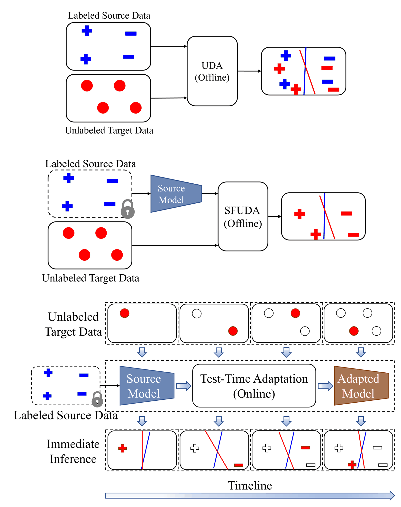
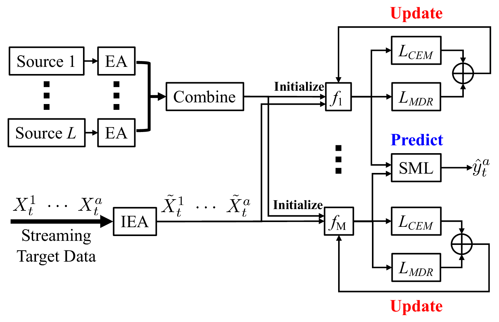
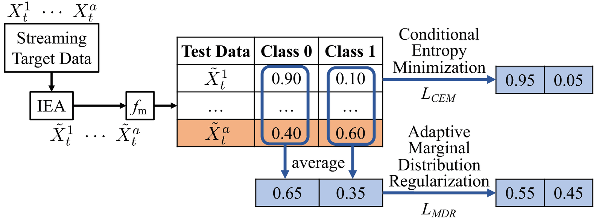
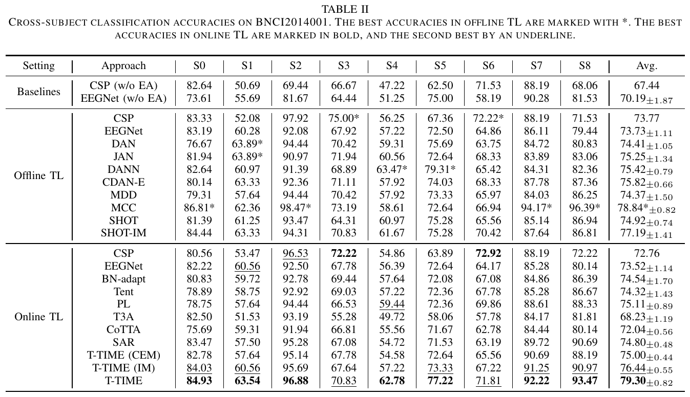
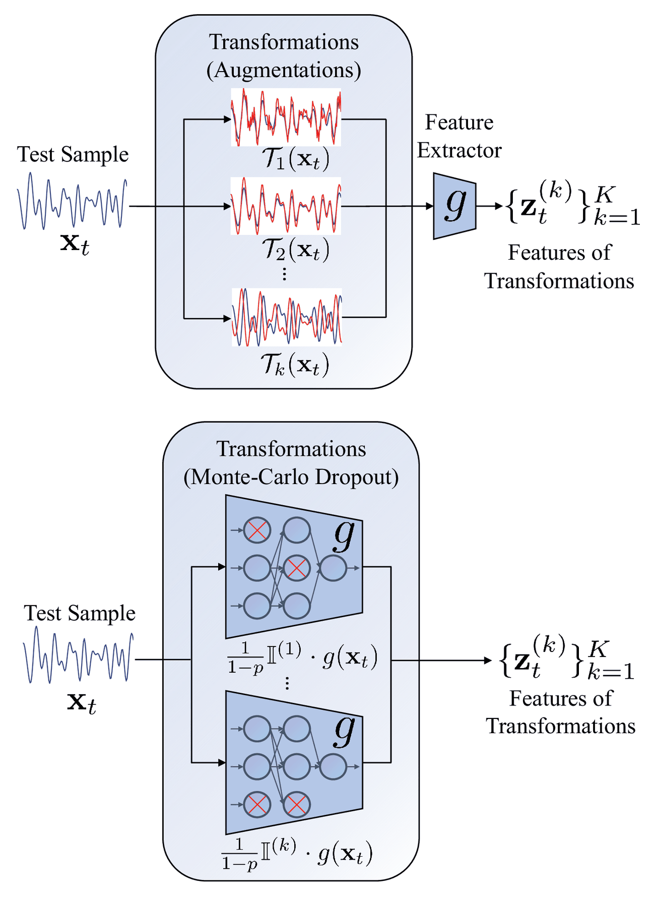
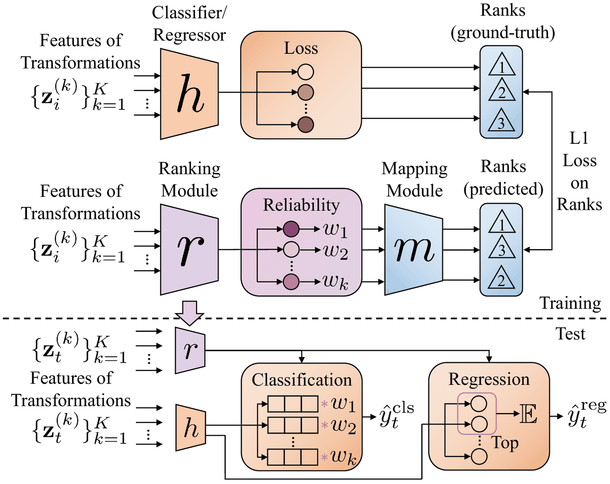
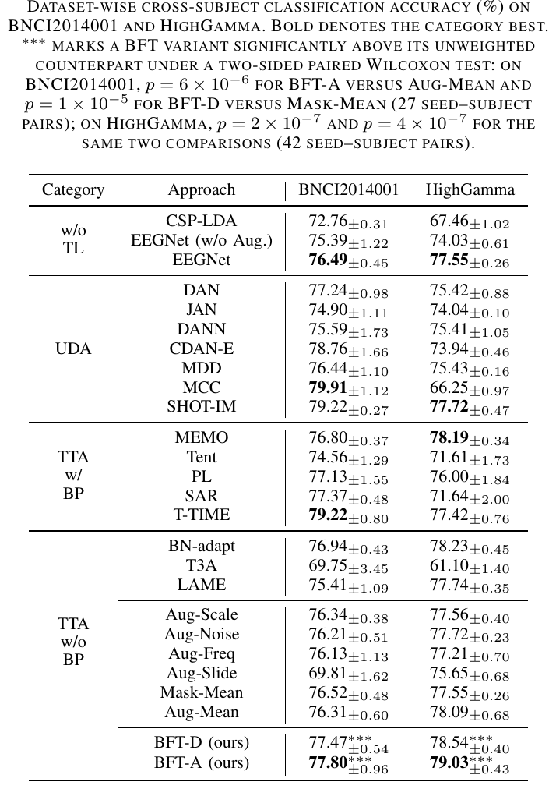
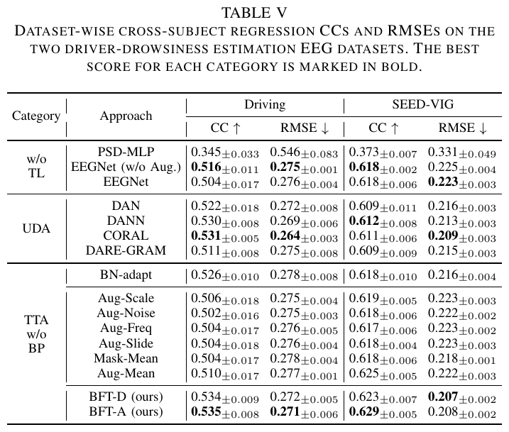

<div align="center">

# DeepTransferEEG

**Deep Transfer Learning for EEG-Based Brain–Computer Interfaces**

Brain-Computer Interface and Machine Learning Laboratory &nbsp;·&nbsp; Huazhong University of Science and Technology

<br>

Online **test-time adaptation** of an EEG decoder to a new user from unlabeled, streaming signals — so no per-use calibration session is needed.

<br>


[**T-TIME paper**](https://ieeexplore.ieee.org/abstract/document/10210666) &nbsp;·&nbsp; [**BFT paper**](https://arxiv.org/abs/2601.07556) &nbsp;·&nbsp; [**BibTeX**](#citation) &nbsp;·&nbsp; [**HUST-BCIML hub**](https://github.com/sylyoung/HUST-BCIML)

</div>

---

<p align="center"></p>

*The three transfer-learning settings for a fully unlabeled target user (Fig. 1 of the T-TIME paper):
(a) UDA and (b) SFUDA adapt **offline** with all target data at once, whereas (c) **test-time
adaptation (TTA)** — the setting both methods here target — must classify a **streaming** target
online.*

> **Two papers on test-time adaptation for EEG BCIs**, plus ~15 classical and state-of-the-art
> transfer-learning baselines on a common [EEGNet](https://iopscience.iop.org/article/10.1088/1741-2552/aace8c) backbone.
>
> - **T-TIME** &nbsp;·&nbsp; *Test-Time Information Maximization Ensemble for Plug-and-Play BCIs* &nbsp;·&nbsp; IEEE TBME 2024 &nbsp;·&nbsp; [Paper](https://ieeexplore.ieee.org/abstract/document/10210666) &nbsp;·&nbsp; [BibTeX](#citation)
> - **BFT** &nbsp;·&nbsp; *Backpropagation-Free Test-Time Adaptation for Lightweight EEG-Based BCIs* &nbsp;·&nbsp; arXiv 2026 &nbsp;·&nbsp; [Paper](https://arxiv.org/abs/2601.07556) &nbsp;·&nbsp; [BibTeX](#citation)

## Contents

- [Overview](#overview)
- [For newcomers](#for-newcomers)
- [Installation](#installation)
- [Data](#data)
- [T-TIME](#t-time)
- [BFT](#bft)
- [Implemented baselines](#implemented-baselines)
- [Hyperparameters](#hyperparameters)
- [Repository structure](#repository-structure)
- [Citation](#citation)
- [Acknowledgements](#acknowledgements)
- [Contact](#contact)
- [License](#license)

<br>

## Overview

EEG signals differ markedly across people and drift over time, so a BCI decoder trained on previous
users usually needs a fresh calibration session for each new user — slow and user-unfriendly. Transfer
learning removes or shortens that calibration by reusing knowledge from source subjects. This repo
targets the hardest and most practical version of the problem: the target user is **completely
unlabeled**, and in the *online* case the target trials arrive **one at a time and must be classified
immediately**. Both proposed methods operate at test time on a frozen source model — **T-TIME** adapts
the model online by information maximization and a spectral ensemble, while **BFT** adapts using only
forward passes, with no gradients or parameter updates at all.

<br>

## For newcomers

New to deep learning, EEG decoding, or Python? Start with the one-file, heavily commented pipeline in
[`easy_demo/EEGNet_demo.py`](easy_demo/EEGNet_demo.py). If you only want to see how **Euclidean
Alignment** is implemented, it is [here](tl/utils/utils.py#L475).

<br>

## Installation

```sh
git clone https://github.com/sylyoung/DeepTransferEEG.git
cd DeepTransferEEG
conda env create -f environment.yml
```

<br>

## Data

Download and prepare the datasets with:

```sh
sh prepare_data.sh
```

Experiments use five public EEG datasets — three motor-imagery (MI) classification sets
(**Zhou2016**, **BNCI2014001**, **HighGamma**) and two driver-drowsiness **regression** sets
(**Driving**, **SEED-VIG**). Pre-trained source models (source-combined **EA + EEGNet**) are provided
under [`runs/`](runs/) so you can skip source training; see [`data/README.md`](data/README.md) for
details.

---

## T-TIME

**Test-Time Information Maximization Ensemble for Plug-and-Play BCIs** &nbsp;·&nbsp; IEEE TBME 2024

<p align="center"></p>

**T-TIME** accommodates the most challenging transfer setting for BCIs: **online** test-time
adaptation, where unlabeled EEG trials from a new user arrive in a stream and each must be classified
on arrival, with no calibration. It combines three ideas (shown in the framework above):

- **Aligned source ensemble.** Each source subject's trials are whitened by **Euclidean Alignment
  (EA)** — dividing by the square root of their mean covariance — to reduce inter-subject variability.
  All aligned sources are pooled to train `M` EEGNet models from different random initializations.
- **Online alignment + ensemble prediction.** Each incoming target trial is aligned by **Incremental
  EA (IEA)**, which updates the reference covariance as the stream grows, then classified by all `M`
  models. Their probabilities are combined by ensemble learning: plain averaging while few samples
  have arrived, then the **Spectral Meta-Learner (SML)**, which weights each model by a reliability
  score read from the leading eigenvector of the models' prediction-covariance matrix (proportional to
  balanced accuracy).
- **Test-time information maximization.** Each model is updated online on a sliding batch by minimizing
  **conditional entropy** (`L_CEM`, to sharpen per-sample predictions) together with an **adaptive
  marginal distribution regularizer** (`L_MDR`) that prevents collapse onto a dominant class. Unlike
  the usual information-maximization loss, `L_MDR` estimates the class marginal from
  confidence-thresholded pseudo-labels, so it stays robust under the **class-imbalance** common in
  online BCI streams.

<p align="center"></p>

*Online target-model update: conditional entropy minimization (`L_CEM`) sharpens each prediction,
while adaptive marginal distribution regularization (`L_MDR`) keeps the predicted class marginal from
collapsing.*

### Usage

```sh
sh test.sh                       # or: python ./tl/ttime.py   — run T-TIME
python ./tl/ttime_ensemble.py    # ensemble step (SML): run after T-TIME for the ensemble results
```

To (re)train the source EEGNet models instead of using the provided ones:

```sh
sh train.sh                      # or: python ./tl/dnn.py
```

### Results

<p align="center"></p>

*Cross-subject accuracy on BNCI2014001 (Table II of the paper). Against more than 20 offline and online
transfer-learning methods, online **T-TIME** achieves the best average accuracy — the first TTA method
for plug-and-play EEG BCIs.*

---

## BFT

**Backpropagation-Free Test-Time Adaptation for Lightweight EEG-Based BCIs** &nbsp;·&nbsp; arXiv 2026

**BFT** (Backpropagation-Free Transformations) brings test-time adaptation to **lightweight,
resource-constrained** BCI hardware: it adapts using **only forward passes** — no gradients, no
parameter updates, no batched inputs. For each test trial it produces several predictions from
structured, label-preserving perturbations, in two families:

<p align="center"></p>

- **BFT-A (knowledge-guided augmentations):** EEG-specific augmentations of the input — amplitude
  scaling, additive noise, frequency shift, and sliding-window crops.
- **BFT-D (deterministic dropout subnetwork bank):** a *fixed* set of feature masks applied after the
  feature extractor, each defining a repeatable subnetwork — a deterministic counterpart of
  Monte-Carlo dropout.

If the model is well-aligned to the new user, its predictions should be **stable** across these
perturbations, so their disagreement is a **label-free uncertainty signal**. A **learning-to-rank**
module `r(·)`, trained once on source data with an auxiliary mapping module `m(·)` that turns task
losses into rank-like targets, scores the reliability of each transformed prediction. Predictions are
then aggregated — for **classification**, a reliability-weighted, temperature-sharpened convex
combination of class probabilities; for **regression**, the mean of the top-half most-reliable
branches.

<p align="center"></p>

*The ranking module is trained on source data to rank each transformation's reliability (top), then at
test time its weights drive the classification/regression aggregation (bottom).*

BFT is compatible with EA and BN-adapt for marginal shift, is privacy-preserving and noise-robust, and
supports both classification and regression, with a variance-reduction theoretical justification.

### Usage

```sh
python ./tl/bft.py    # choose BFT-A (augmentations) or BFT-D (masked subnetworks) via the `variant` setting
```

### Results

<p align="center">

&nbsp;&nbsp;

</p>

*Left — cross-subject MI classification on BNCI2014001 and HighGamma (Table III); right —
driver-drowsiness regression on Driving and SEED-VIG (Table V). Both BFT variants significantly beat
their unweighted counterparts (Aug-Mean / Mask-Mean), confirming that the learned reliability ranking,
not just the extra forward passes, drives the gains.*

---

## Implemented baselines

All baselines share the EA + EEGNet backbone and are run the same way — `python ./tl/<method>.py`
(classical CSP-LDA is `python ./ml/feature.py`). Each lives behind its own script so results are
reproduced one method at a time.

| Method | Category | Description | Reference |
| --- | --- | --- | --- |
| **EA** | Alignment | Euclidean Alignment: whitens each subject's trials by their mean covariance to a shared reference; backprop-free and used by all methods below. | IEEE TBME 2020 |
| **CSP-LDA** | Classical | Common Spatial Patterns + Linear Discriminant Analysis — the classical MI decoding pipeline. | IEEE SPM 2008 |
| **EEGNet** | Backbone | Compact convolutional network for EEG; the source model every deep method adapts. | J. Neural Eng. 2018 |
| **DAN** | UDA | Deep Adaptation Network: aligns feature distributions via multi-kernel MMD. | ICML 2015 |
| **JAN** | UDA | Joint Adaptation Network: aligns the joint distribution of features and predictions. | ICML 2017 |
| **DANN** | UDA | Domain-Adversarial Neural Network: domain-invariant features via a gradient-reversal discriminator. | JMLR 2016 |
| **CDAN** | UDA | Conditional Domain Adversarial Network: conditions the adversary on classifier predictions. | NeurIPS 2018 |
| **MDD** | UDA | Margin Disparity Discrepancy: minimizes a margin-based domain discrepancy that bounds target error. | ICML 2019 |
| **MCC** | UDA | Minimum Class Confusion: reduces pairwise class confusion of target predictions. | ECCV 2020 |
| **SHOT** | SFUDA | Source HypOthesis Transfer: freezes the source classifier and adapts features by information maximization + self-supervised pseudo-labels. | IEEE TPAMI 2022 |
| **ISFDA** | SFUDA | Imbalanced Source-Free DA: intra-class tightening and inter-class separation for class-imbalanced targets. | ACM MM 2021 |
| **BN-adapt** | TTA | Replaces BatchNorm statistics with target-batch statistics. | NeurIPS 2020 |
| **Tent** | TTA | Test-time entropy minimization over the normalization-layer affine parameters. | ICLR 2021 |
| **PL** | TTA | Pseudo-Labeling: online self-training on confident predictions. | ICML-W 2013 |
| **T3A** | TTA | Test-Time Template Adjuster: backprop-free refinement of class prototypes from test features. | NeurIPS 2021 |
| **CoTTA** | TTA | Continual TTA: weight- and augmentation-averaged teacher–student pseudo-labels for continually shifting streams. | CVPR 2022 |
| **SAR** | TTA | Sharpness-Aware Reliable entropy minimization: filters unreliable samples and seeks flat minima. | ICLR 2023 |
| **DELTA** | TTA | Degradation-freE fuLly Test-time Adaptation: dynamic online re-weighting for test-time class-imbalance. | ICLR 2023 |

Other approaches can be executed the same way — run any `python ./tl/*.py` for its results.

<br>

## Hyperparameters

Most hyperparameters/configurations live in the `args` variable inside the `main` function of each
file, with self-explanatory names.

<br>

## Repository structure

```
tl/                     # deep transfer-learning methods (core)
  ttime.py              # T-TIME (proposed)
  ttime_ensemble.py     # T-TIME ensemble step (SML)
  bft.py                # BFT (proposed); BFT-A / BFT-D via `variant`
  dnn.py                # train EA + EEGNet source models
  dan/jan/dann/cdan/mdd/mcc.py     # UDA baselines
  shot.py  isfda.py                # source-free UDA baselines
  bn-adapt/tent/pl/t3a/cotta/sar/delta.py   # test-time adaptation baselines
  models/               # EEGNet and other backbones
  utils/                # Euclidean Alignment (utils.py) + data utilities
ml/feature.py           # classical CSP-LDA pipeline
easy_demo/              # one-file EEGNet tutorial with detailed comments
deployment/             # real-time online BCI deployment (Neuracle device)
runs/                   # provided EA + EEGNet source models
data/  logs/            # datasets and experiment logs
figures/                # figures used in this README
```

<br>

## Citation

If you find this repo helpful, please cite our work:

```bibtex
@Article{Li2024,
  author  = {Li, Siyang and Wang, Ziwei and Luo, Hanbin and Ding, Lieyun and Wu, Dongrui},
  journal = {IEEE Transactions on Biomedical Engineering},
  title   = {{T}-{TIME}: Test-Time Information Maximization Ensemble for Plug-and-Play {BCI}s},
  year    = {2024},
  number  = {2},
  pages   = {423-432},
  volume  = {71},
  doi     = {10.1109/TBME.2023.3303289},
}

@article{Li2026,
  author  = {Li, Siyang and Ouyang, Jiayi and Cui, Zhenyao and Wang, Ziwei and Jia, Tianwang and Wan, Feng and Wu, Dongrui},
  journal = {arXiv preprint arXiv:2601.07556},
  title   = {Backpropagation-Free Test-Time Adaptation for Lightweight {EEG}-Based Brain-Computer Interfaces},
  year    = {2026},
}
```

<br>

## Acknowledgements

All credit for the base framework goes to [Wen Zhang](https://github.com/chamwen); do check out the
[Negative Transfer](https://github.com/chamwen/NT-Benchmark) project.

<br>

## Contact

For questions about the papers, contact syoungli@hust.edu.cn or lsyyoungll@gmail.com. For questions
about the code, please open an Issue.

<br>

## License

Released under the [MIT License](LICENSE).

---

<div align="center"><sub>

Part of the <a href="https://github.com/sylyoung/HUST-BCIML">HUST-BCIML</a> open-source code home &nbsp;·&nbsp; Brain-Computer Interface and Machine Learning Laboratory, HUST

</sub></div>
